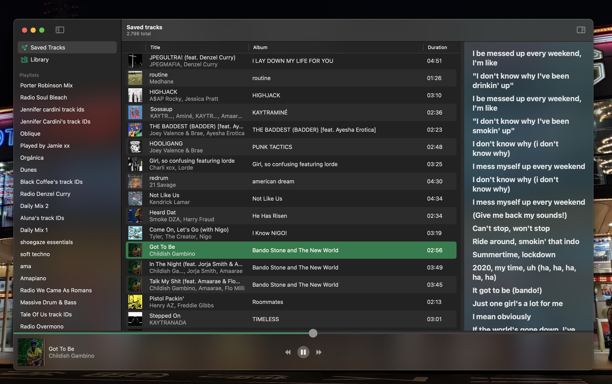

# 

Native MacOS Spotify client, fully written in SwiftUI with a rusty core.

**Still in development!**

## Background
This is a frontend for [librespot](https://github.com/librespot-org/librespot), similar to [Spot](https://github.com/xou816/spot).  
Librespot runs from rust-land and communication back to Swift happens through [swift-bridge](https://github.com/chinedufn/swift-bridge).

## Status
- ✅ Logging in through oauth
- Playback
  - ✅ Music playback
  - ✅ Play/pausing
  - ✅ Seeking
  - Next/prev track
  - Playback queue
  - Auto play when queue ends
  - Volume
- Playlists
  - ✅ Retrieve user playlists
  - Playlist view
- Lyrics
  - ✅ Show lyrics
  - Karaoke mode (sync lines to playback)
- Artist profile
- Library
- Album view
- Settings
  - Normalizer settings
- Device control (spirc)
  - Let Speck be controlled through Spirc
  - Control other spirc devices
